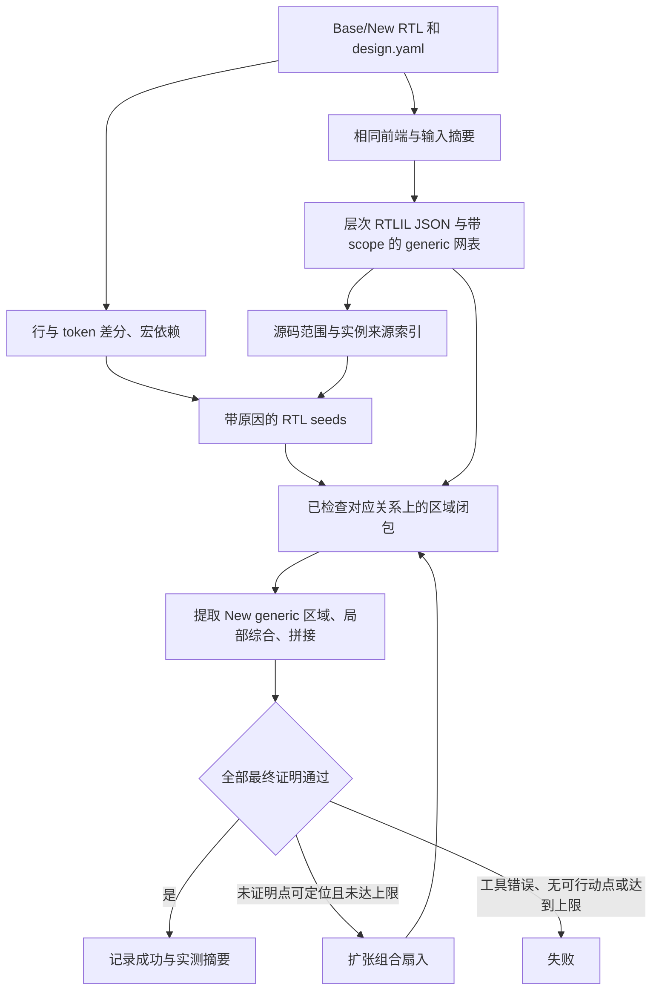

# RTL 引导的组合逻辑 ECO

这一版实现“RTL 定位器 + 已有 generic 增量闭环”。RTL 提示影响重综合区域，
但不授予 cell 复用权限。完整 New generic 网表仍是本版必要输入。证明比较
stitched 与 New，采用已有的参考 X 为 don’t-care 的有方向验证语义。

## 数据流



## 实现分工

- `scripts/synthesis/run_frontend.py`：`proc -noopt` 后保存
  `elaborated_hier.json`，再执行 `opt_expr; flatten -scopename` 与原有优化。
  保存点必须位于 `proc` 内部的常量优化之前，否则 `$xor` 改写为 `$not` 等
  操作可能已经丢失来源。`source_manifest.json` 记录源码、递归 literal include、
  配置、前端脚本、网表摘要、Git 提交和 Yosys 版本。
- `analysis/rtl_diff.py`：基于实际前端输入快照比较行与 token，忽略注释／纯格式
  修改，标记 module、接口、parameter/generate、类型、实例连接修改。
  宏定义变化沿宏之间的引用传递，再定位 active inputs 中的使用点。
- `analysis/source_map.py`：保留完整起止行列和 `|` 分隔的多来源；遍历 elaborated
  hierarchy，区分同一 module 的多个实例。用来源范围、实例路径及公开输出别名
  建立 RTL 源范围 → 层次 RTLIL 对象 → optimized cell 的多对多**提示**。
  `direct_sources` 与补充的 `sources` 分开记录；这不是精确的逐 pass 来源追踪。
- `analysis/rtl_impact.py`：产生 direct overlap、macro dependency 和 context
  dependency 种子。实例连接修改优先限定被修改的子实例；位宽、类型、参数或
  接口修改保守扩大相关实例上下文。未实例化 module 和未使用宏不强制全设计重建。
- `analysis/rtl_region.py`：种子向前／向后经过未确认可复用的组合邻居扩张，在
  已检查的对应点及状态边界停止。独立记录 functional fanout，避免将其混称为
  重综合区域。第一版还检查时钟／复位／使能的扇入，不支持这些函数的未确认变化。
- `analysis/region.py`：允许显式 Base/New 区域。选择一对对应 cell 的任一端就
  撤销整对复用资格；所有未匹配组合 cell 仍必须补入区域，不允许因 RTL 漏定位
  而静默保留。状态变化、顶层接口变化及未闭合边界继续阻止拼接。
- `formal/verify_transition.py`：为顶层输出、寄存器输入和内部义务输出名称映射。
  只读取 `equiv_status` 最终未证明列表，不把中途 SAT 尝试或超时当作反例。
- `scripts/run_incremental_case.py`：失败点映射回原设计后，扩大一层组合扇入，
  重新提取／综合／拼接／验证。若重复失败则从当前区域继续向输入扩张；不能扩张
  或超过上限时返回失败。不会吸收状态单元，也不会忽略未证明点宣布成功。

带 scope 的自动 cell 会产生更多结构候选，因此 matcher 现在先从状态与顶层
引脚回溯对应关系，再以结构候选补足空缺，避免错误候选抢占另一寄存器的驱动。

`flatten -scopename` 的属性行为参见
[Yosys 官方文档](https://yosyshq.readthedocs.io/projects/yosys/en/v0.50/cmd/flatten.html)。

## 运行与审计

```sh
# RTL 引导：先生成可追溯的两份前端产物
python scripts/run_incremental_case.py eco-002 \
  --frontend --rtl-guided --seed-mode hybrid --formal --max-expansions 5

# 对同一组缓存产物试验 RTL 初始种子
python scripts/run_incremental_case.py eco-002 --seed-mode rtl --formal

# 原网表差分基线；无需来源快照
python scripts/run_incremental_case.py eco-002 --seed-mode netlist --formal

# 仅定位、规划，不运行局部综合和最终证明
python analysis/run_incremental.py plan eco-002 --seed-mode hybrid
```

`rtl` 与 `hybrid` 的区别是初始区域，不是正确性保证：两者最终都会补齐不能
确认复用的组合逻辑。`safety_completion_cells` 说明 RTL-only 初始区域遗漏了
哪些网表参考 cell。模块声明和类型的保守处理可能使 RTL 区域明显大于基线。

结果位置：

| 文件 | 内容 |
| --- | --- |
| `analysis/rtl_changes.json` | 修改行、模块、宏、top 可达性和被设计配置排除的修改文件 |
| `analysis/source_index_{base,new}.json` | 完整来源、实例、RTLIL 对象提示与缺失来源统计 |
| `analysis/rtl_seed_cells.json` | 每个种子的原因、未映射提示及独立的功能影响锥 |
| `analysis/rtl_region.json` | 种子与网表差分参考区域的重合度及定位耗时 |
| `analysis/region_plan.json` | 最终选区、保留对应、逐位边界与不支持原因 |
| `analysis/rtl_experiment.json` | 紧凑实验摘要、工具／代码／输入身份、状态与区域指标 |
| `incremental/run_report.json` | 每轮耗时、证明状态、扩张次数和证据目录 |
| `incremental/attempts/<run>/<round>/` | 每一轮独立保存的区域计划、未证明点映射和证明日志 |

重合指标比较的是**源码组合种子**与**保守网表差分区域**，参考区域不是真实最小
区域。分母为 0 时指标为 null。总耗时标明是否包含 frontend；尚无同口径全量
综合计时，`speedup` 和 `liberty_area` 保持 null。cell 统计排除 `$scopeinfo`。

## 当前验证结果

本机 Yosys `0.67+24 (0e82bbefe)`，eco-002 使用上面的 hybrid + formal 命令：

- Base/New 普通 generic cell：427 / 419。
- RTL 初始组合种子：38 / 33。
- 最终替换 Base/New 区域：41 / 33；保留 Base cell：386。
- 最终验证通过，无需扩张；multicycle 下的 4 个修改文件被排除。
- 5 个修改的 `MC_*` 宏在当前 active RTL 中没有使用点，不产生宏传播种子。

这些是当前前端与选项的一次结果；不要与旧前端 295/293 的统计混合。机器相关
耗时以本地 `rtl_experiment.json` 为准，报告还记录脚本和实现文件的 SHA-256。

人工回归覆盖常量、操作数、mux 条件、宏使用、未使用宏、死 module、注释、
信号重命名、generate 参数、signedness、多实例中的单实例重连、状态控制变化、
过期输入拒绝，以及注入错误复用候选后由真实 SAT 拒绝并扩张修复的闭环。

## 明确限制与下一阶段

- 差分器是注释感知的词法提示层，不是完整 SystemVerilog AST／类型／依赖分析。
  条件编译分支只做保守提示；不对任意宏展开、宏生成 include 或外部 include
  提供精确 provenance。RTL 模式遇到无法解析的 include 会要求处理输入，
  可显式选择 netlist 基线。
- 不支持任意优化变换的精确历史追踪；无来源 cell 必须依靠 checked netlist
  closure 补全，最终形式证明负责接受或拒绝结果。
- 此版从完整 New generic 网表提取局部区域，尚未从 New RTL 生成独立的局部
  RTL module。下一阶段需要语义对象及其参数、宏、类型、连接依赖的闭包，
  再生成和 Base 位级边界一致的局部模块；不能把变化的几行代码直接交给 Yosys。
- 状态重编码、重定时、memory 结构修改、顶层接口修改不由本流程自动解决。
  未证明点扩张是有限的启发式，不保证找到最小区域或保证每个 ECO 都能完成。
